# splunk-siem-universal-forwarder
Hands-on Splunk SIEM lab demonstrating the setup of Splunk Enterprise and deployment of Splunk Universal Forwarder for centralized Windows event log collection, monitoring, and analysis.

# Splunk SIEM Setup and Universal Forwarder Deployment

## 📑 Table of Contents

* [Project Overview](#project-overview)
* [Objectives](#-objectives)
* [Lab Environment](#-lab-environment)
* [Tools Used](#-tools-used)
* [Project Implementation](#-project-implementation)

  * [1. Downloading Splunk Enterprise](#1-downloading-splunk-enterprise)
  * [2. Installing Splunk Enterprise](#2-installing-splunk-enterprise)
  * [3. Configuring Splunk Receiving](#3-configuring-splunk-receiving)
  * [4. Downloading and Installing Splunk Universal Forwarder](#4-downloading-and-installing-splunk-universal-forwarder)
  * [5. Installing and Configuring Splunk Universal Forwarder](#5-installing-and-configuring-splunk-universal-forwarder)
  * [6. Verifying Forwarded Windows Logs in Splunk Enterprise](#6-verifying-forwarded-windows-logs-in-splunk-enterprise)
* [Skills Earned](#-7-skills-earned)
* [Key Learnings](#-8-key-learnings)
* [Conclusion](#-9-conclusion)

## 📖 Project Overview

This project focused on setting up a **Security Information and Event Management (SIEM) lab using Splunk Enterprise and the Splunk Universal Forwarder**. Splunk Enterprise was deployed on a Windows system to function as the central SIEM platform, while a separate **Windows 11 virtual machine running in VMware Workstation** was configured with the Splunk Universal Forwarder.

The Universal Forwarder was configured to collect Windows event logs, including **Application, Security, and System logs**, and forward them to the Splunk Enterprise server. The successful appearance of the Windows host and its associated event sources in Splunk Enterprise confirmed that the **log collection and forwarding process was functioning successfully**.

## 🎯 Objectives

The main objectives of the project were:

* To understand the basic architecture and functionality of a **SIEM platform**.
* To install and configure **Splunk Enterprise** as a centralized log management and monitoring platform.
* To install and configure the **Splunk Universal Forwarder** on a Windows 11 endpoint.
* To configure Splunk Enterprise to receive forwarded log data.
* To establish communication between the **Universal Forwarder and Splunk Enterprise**.
* To collect and monitor **Windows Application, Security, and System event logs**.
* To verify successful log forwarding and analyze the received events using **Splunk Search & Reporting**.

## 🖥️ Lab Environment

| Component                   | Configuration                                  |
| --------------------------- | ---------------------------------------------- |
| **SIEM Platform**           | Splunk Enterprise                              |
| **Log Collection Agent**    | Splunk Universal Forwarder                     |
| **Virtualization Platform** | VMware Workstation                             |
| **SIEM Server**             | Windows system running Splunk Enterprise       |
| **Endpoint**                | Windows 11 virtual machine                     |
| **Log Sources**             | Windows Application, Security, and System logs |
| **Receiving Port**          | 9997                                           |
| **Deployment Server Port**  | 8089                                           |
| **Monitoring Interface**    | Splunk Web / Search & Reporting                |

## 🛠️ Tools Used

* **Splunk Enterprise** – Central SIEM platform used for receiving, indexing, searching, and monitoring security events.
* **Splunk Universal Forwarder** – Used to collect and forward Windows event logs to Splunk Enterprise.
* **VMware Workstation** – Used to host the Windows 11 virtual machine used as the log-generating endpoint.
* **Windows 11** – Endpoint operating system used for generating and collecting Windows event logs.
* **Windows Command Prompt (`ipconfig`)** – Used to identify the IPv4 address of the Splunk Enterprise server.
* **Splunk Web / Search & Reporting** – Used to verify hosts, sources, event counts, and received logs.

### 1. Downloading Splunk Enterprise

The first step in the SIEM lab setup was to obtain the **Splunk Enterprise** installation package from the official Splunk website.

#### Procedure

1. Navigate to the [official Splunk website](https://www.splunk.com/?utm_source=chatgpt.com).
2. Navigate to **Trials & Downloads** and select **Start Your Free Trial**.
3. Enter the required account information and complete the account registration process.
4. Verify the account using the verification code sent to the registered email address.
5. After completing the account creation process, navigate to the **Splunk Enterprise** download section.
6. Select **Windows** as the target operating system and choose the appropriate Splunk Enterprise installation package.
7. Download the installation package to the Windows system that will be used for the SIEM lab.

#### Purpose

This step provides the **Splunk Enterprise installation package** required to deploy the central SIEM platform. Splunk Enterprise will subsequently be configured to receive and analyze security logs forwarded from the Windows endpoint using the **Splunk Universal Forwarder**.

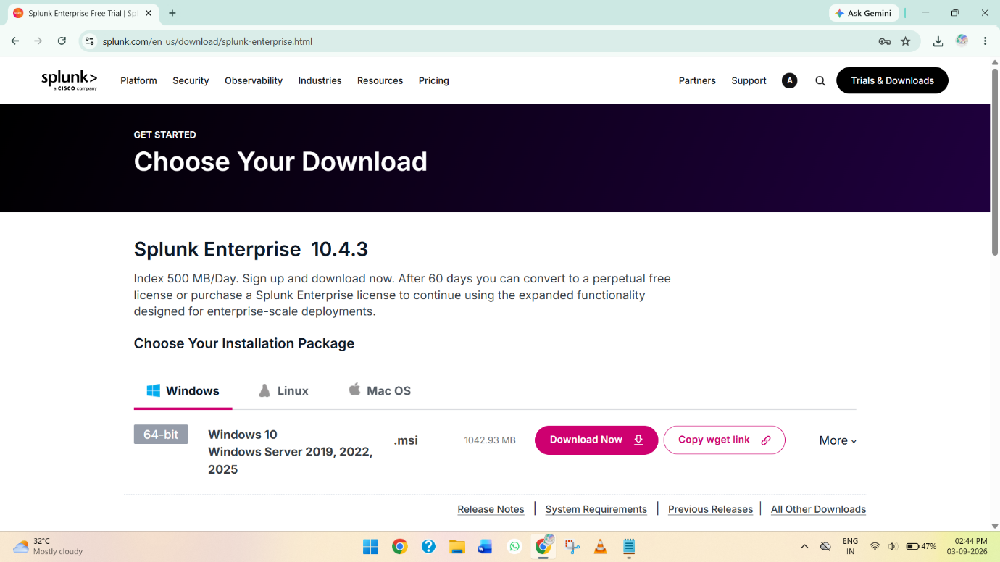

*Figure 1: Splunk Enterprise download page showing the Windows installation package.*

### 2. Installing Splunk Enterprise

The downloaded Splunk Enterprise installation package was located in the **Downloads** folder and used to install Splunk Enterprise on the Windows system.

#### Procedure

1. Navigate to the **Downloads** folder and locate the downloaded Splunk Enterprise installer.
2. Open the installer to launch the **Splunk Enterprise Setup Wizard**.
3. Review the Splunk Enterprise license agreement and accept the terms to continue.
4. Select the installation location for Splunk Enterprise. The default installation directory was used.
5. Create the initial **Splunk administrator account** by entering a username and password.
6. Review the selected installation options and click **Install** to begin the installation.
7. Wait for the installation process to complete.
8. Once the installation is completed successfully, click **Finish** to close the Setup Wizard.

#### Purpose

This step installs **Splunk Enterprise** on the Windows system, establishing the central SIEM platform that will later be configured to **receive, index, search, and analyze security logs** from the Windows endpoint.

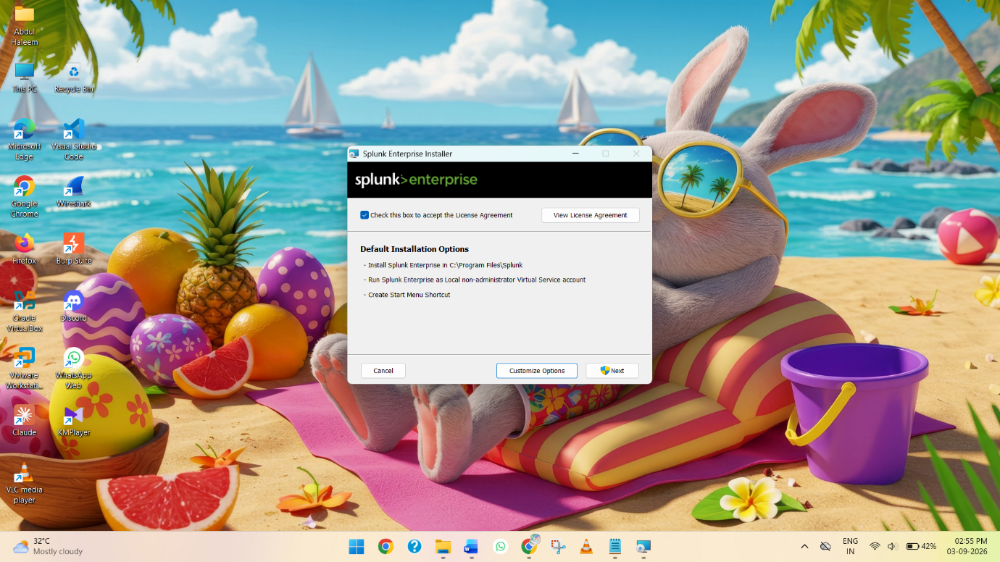

*Figure 2: Splunk Enterprise installation and configuration using the Setup Wizard.*

### 3. Configuring Splunk Receiving

After installing Splunk Enterprise, the application was launched and configured to receive data from the **Splunk Universal Forwarder**.

#### Procedure

1. Launch **Splunk Enterprise** from the Windows system.
2. The Splunk login screen will appear. Enter the **username and password** created during the installation process.
3. After successful authentication, the **Splunk Web interface** will be displayed.
4. Click **Settings** to open the settings menu.
5. Under the **Data** section, select **Forwarding and receiving**.

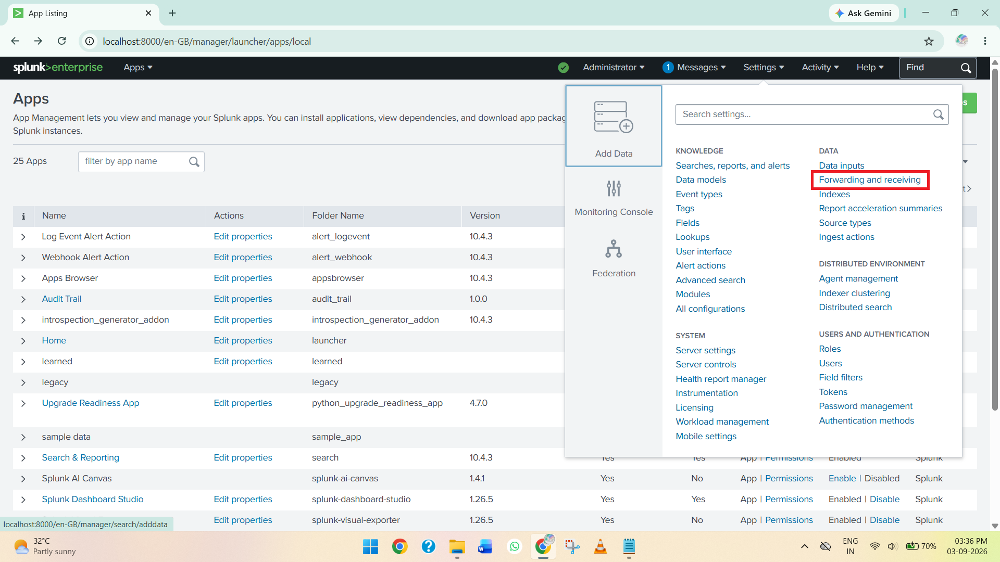

*Figure 3: Accessing the Forwarding and Receiving configuration under Splunk Settings.*

6. In the **Receive Data** section, locate **Configure receiving** and click **Add new**.

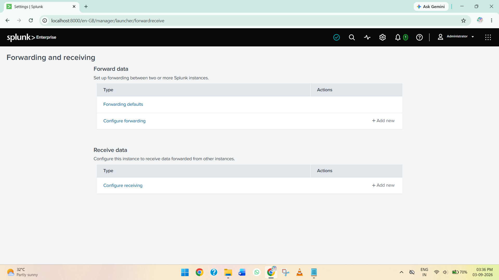

*Figure 4: Receive Data section in the Splunk Forwarding and Receiving configuration.*

7. Specify the port number that Splunk Enterprise will use to receive forwarded data. The default Splunk receiving port **9997** was used.

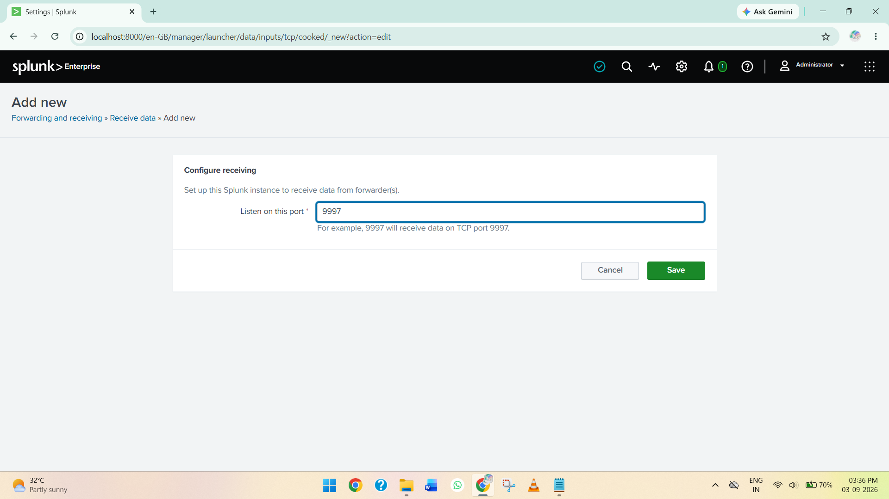

*Figure 5: Configuring Splunk Enterprise to receive forwarded data on port 9997.*

8. Save the configuration to enable Splunk Enterprise to listen for incoming data from the Universal Forwarder.

#### Purpose

This step configures Splunk Enterprise to **receive log data from the Splunk Universal Forwarder**. Port **9997** is used as the receiving port through which forwarded event data is sent from the Windows endpoint to the Splunk Enterprise server.

### 4. Downloading and Installing Splunk Universal Forwarder

A separate **Windows 11 virtual machine** was prepared in **VMware Workstation** to function as the endpoint for the Splunk Universal Forwarder. The Universal Forwarder was installed on this system to collect and forward Windows event logs to the Splunk Enterprise server.

#### Procedure

1. Launch **VMware Workstation** and start the prepared **Windows 11 virtual machine**.

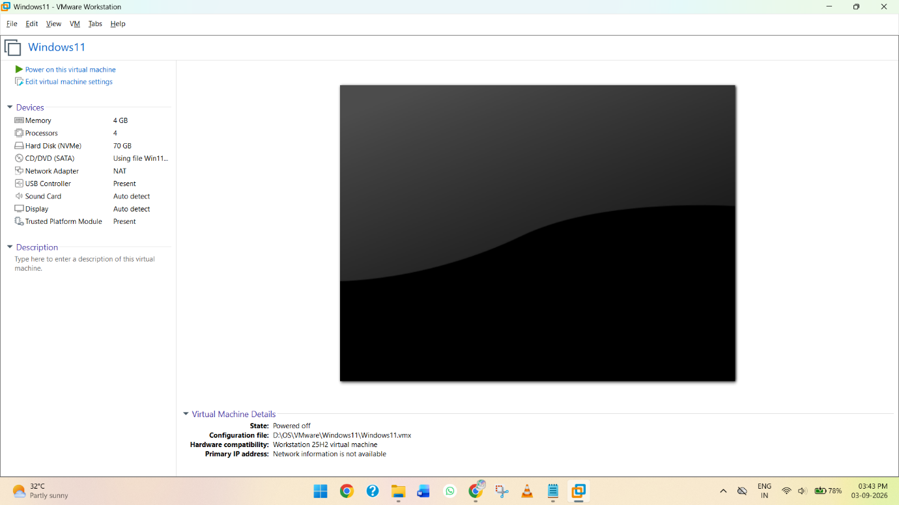

*Figure 6: Windows 11 virtual machine prepared for Splunk Universal Forwarder installation.*

2. Open a web browser within the Windows 11 virtual machine and navigate to the [official Splunk website](https://www.splunk.com/?utm_source=chatgpt.com).
3. Navigate to the **Splunk Universal Forwarder** download section.
4. Select **Windows** as the target operating system and download the appropriate **Splunk Universal Forwarder** installation package.

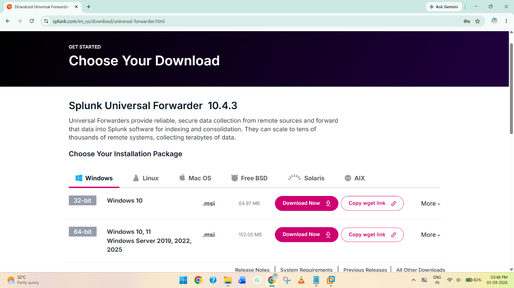

*Figure 7: Splunk Universal Forwarder page showing the Windows installation package.*

5. After the download is complete, navigate to the **Downloads** folder.
6. Locate the downloaded Splunk Universal Forwarder installer and open it to begin the installation process.

#### Purpose

This step prepares the Windows 11 endpoint for the installation of the **Splunk Universal Forwarder**, which will be used to collect Windows logs and forward them to the Splunk Enterprise server for centralized monitoring and analysis.

### 5. Installing and Configuring Splunk Universal Forwarder

The Splunk Universal Forwarder installation was initiated on the **Windows 11 virtual machine**. During the installation, the required configuration settings were provided to establish communication between the Universal Forwarder and the Splunk Enterprise server.

#### Procedure

1. Open the downloaded **Splunk Universal Forwarder** installer.
2. On the first installation window, review and accept the **license agreement**.
3. Select the **Customize** option to configure the installation.


*Figure 8: Splunk Universal Forwarder installation screen showing the license agreement and customization option.*

4. Proceed through the installation using the default settings where applicable.
5. When prompted to configure the **user account**, select **Local System** as the account under which the Universal Forwarder will run.


*Figure 9: Configuring the Splunk Universal Forwarder to run under the Local System account.*

6. Continue to the log selection window and select the **types of logs to be monitored**. The following Windows event logs were selected:

   * **Application**
   * **Security**
   * **System**

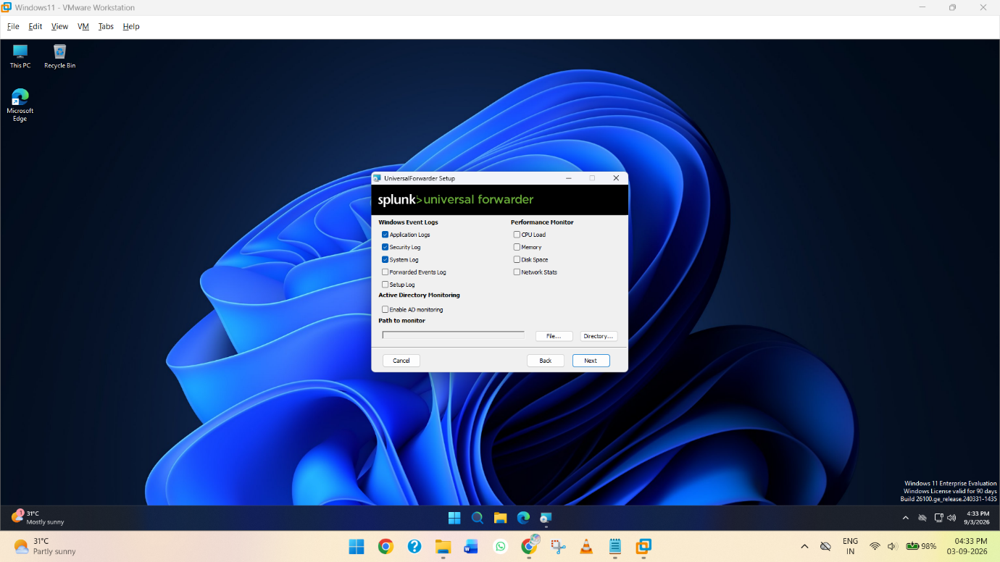

*Figure 10: Selecting Windows log sources to be monitored by the Splunk Universal Forwarder.*

7. During the installation, the **Deployment Server** configuration window will appear. Enter the **hostname or IP address** of the Windows system where Splunk Enterprise is installed.
8. To identify the IP address of the Splunk Enterprise system, open **Command Prompt** and execute:

```cmd
ipconfig
```

9. Identify and copy the **IPv4 Address** of the Splunk Enterprise Windows system.

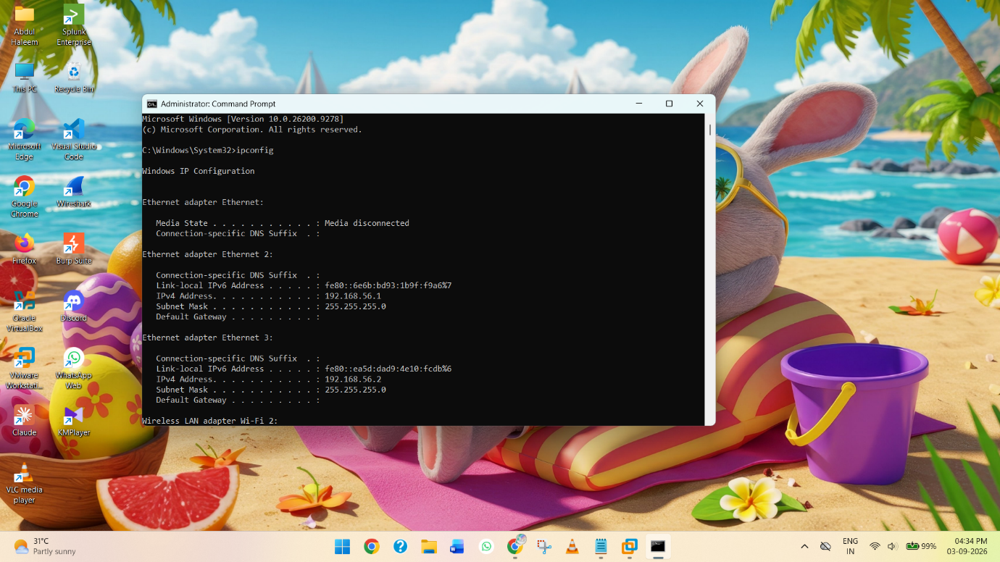

*Figure 11: Obtaining the Splunk Enterprise server IPv4 address using the `ipconfig` command.*

10. Enter the copied IPv4 address in the **Deployment Server** hostname/IP field and use the default port **8089**.


*Figure 12: Configuring the Deployment Server hostname/IP address and port 8089.*

11. Click **Next** to continue.
12. In the **Receiving Indexer** configuration window, enter the **hostname or IP address** of the Windows system running Splunk Enterprise.
13. Enter the receiving port **9997**, which was configured earlier in Splunk Enterprise.

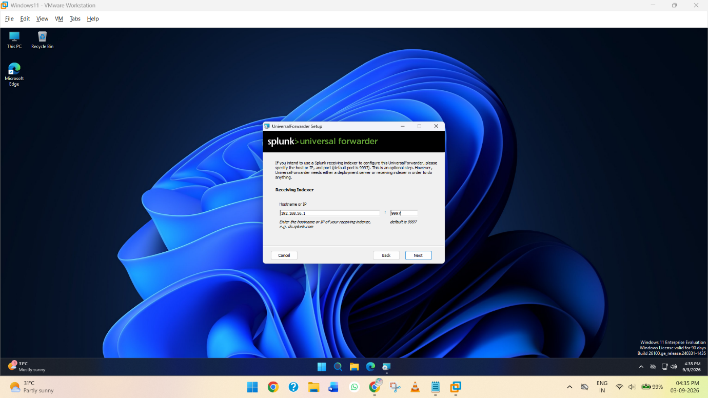

*Figure 13: Configuring the Receiving Indexer using the Splunk Enterprise server address and port 9997.*

14. Click **Next** and review the selected configuration options.
15. Click **Install** to begin installing the Splunk Universal Forwarder.
16. Wait for the installation process to complete.

#### Purpose

This step installs and configures the **Splunk Universal Forwarder** on the Windows 11 endpoint. The **Deployment Server** configuration specifies the Splunk Enterprise server and management port **8089**, while the **Receiving Indexer** configuration specifies the Splunk Enterprise server and receiving port **9997** to which collected logs will be forwarded.

The **Application, Security, and System** event logs selected during installation provide the Windows event data that will subsequently be collected and analyzed through Splunk Enterprise.

### 6. Verifying Forwarded Windows Logs in Splunk Enterprise

After configuring the Splunk Universal Forwarder, the **Splunk Enterprise** interface was accessed to verify that Windows event logs were successfully received from the endpoint.

#### Procedure

1. Open **Splunk Enterprise** and navigate to the **Search & Reporting** application.
2. Select **Data Summary** to view the available indexed data.
3. Under **Hosts**, verify that the number of available hosts has changed to **1**.
4. The hostname of the connected Windows endpoint is displayed. In this lab, the hostname was **DESKTOP-LHM0G2V**.

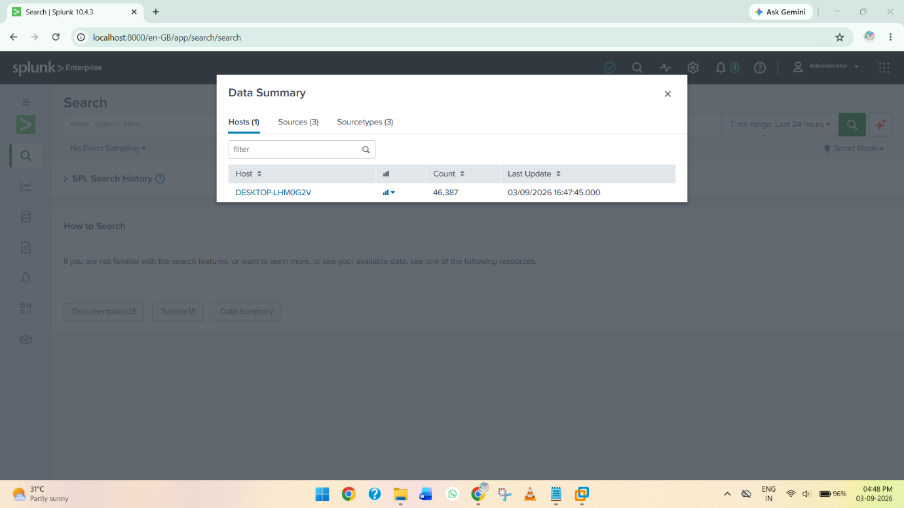

*Figure 14: Splunk Enterprise Data Summary showing the connected Windows host DESKTOP-LHM0G2V.*

5. The **event count** associated with the host can also be viewed, confirming that events are being received.
6. Under **Sources**, the available Windows event log sources can be observed, including **Application, Security, and System** logs.

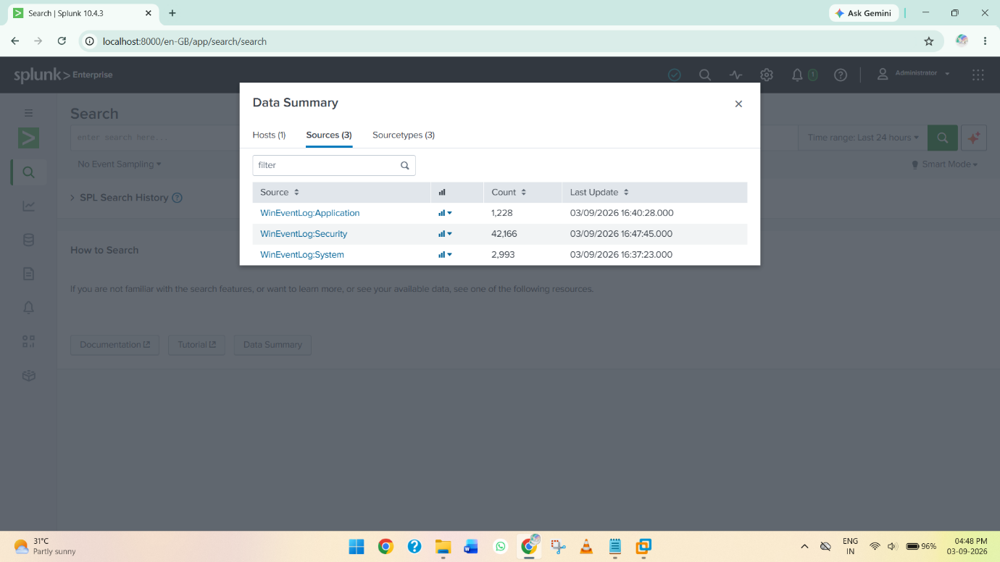

*Figure 15: Windows event log sources received by Splunk Enterprise.*

7. Select the required **Host** or **Source** to view the corresponding events.
8. The received logs can then be searched and monitored using the **Splunk Search & Reporting** interface.

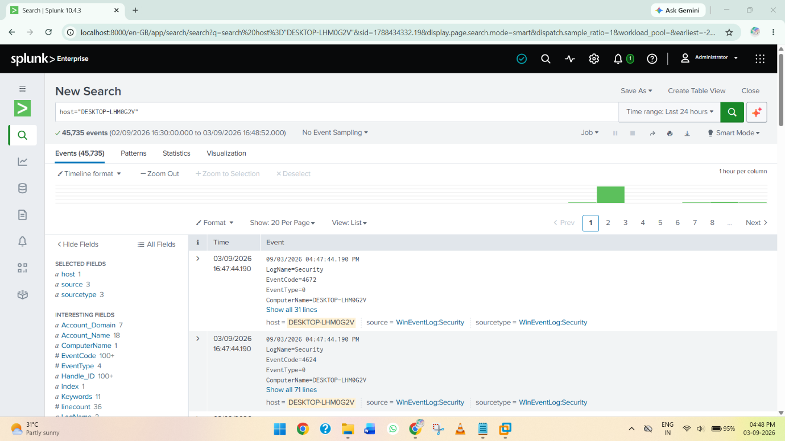

*Figure 16: Windows event logs received and displayed in Splunk Enterprise.*

#### Purpose

This step verifies the successful communication between the **Splunk Universal Forwarder** and **Splunk Enterprise**. The appearance of the Windows host and its **Application, Security, and System** event sources confirms that Windows event data is being successfully forwarded to and indexed by Splunk Enterprise.

The received events can then be searched and monitored through **Splunk Search & Reporting**, demonstrating the successful completion of the Windows log collection and centralized monitoring process.

## 🧠 Skills Earned

Through this project, the following practical skills were developed:

* **Splunk Enterprise installation and configuration**
* **Splunk Universal Forwarder installation and configuration**
* **SIEM architecture and log management concepts**
* **Windows event log collection and monitoring**
* **Configuration of Splunk receiving ports**
* **Configuration of Deployment Server and Receiving Indexer settings**
* **Log forwarding between Windows endpoints and a centralized SIEM**
* **Splunk Search & Reporting and Data Summary usage**
* **Identification and monitoring of Windows hosts and log sources**
* **Basic troubleshooting and verification of SIEM log ingestion**

## 🔑 Key Learnings

This project provided practical experience in deploying a basic **SIEM environment** and understanding how endpoint logs are centralized for security monitoring. It demonstrated the role of **Splunk Enterprise** as the central platform and the **Universal Forwarder** as the log collection and forwarding component.

The project also provided an understanding of how **Windows Application, Security, and System events** can be collected and viewed through a centralized interface. Configuring the receiving port, Deployment Server, and Receiving Indexer helped develop an understanding of communication between the endpoint and SIEM server.

The verification process using **Data Summary** and **Search & Reporting** demonstrated how security analysts can identify connected hosts, examine log sources, review event counts, and search collected events for monitoring and investigation.

## ✅ Conclusion

The project successfully demonstrated the implementation of a basic **SIEM lab using Splunk Enterprise and Splunk Universal Forwarder**. Splunk Enterprise was installed and configured as the centralized SIEM platform, while the Splunk Universal Forwarder was deployed on a **Windows 11 endpoint** to collect and forward Windows event logs.

The successful appearance of the Windows host **DESKTOP-LHM0G2V**, along with the **Application, Security, and System** log sources in Splunk Enterprise, confirmed that the log collection and forwarding process was working successfully.

Overall, the project provided valuable hands-on experience with **SIEM deployment, centralized log collection, Windows event monitoring, Splunk configuration, and basic security monitoring**, establishing a practical foundation for further **SOC and security operations activities**.
